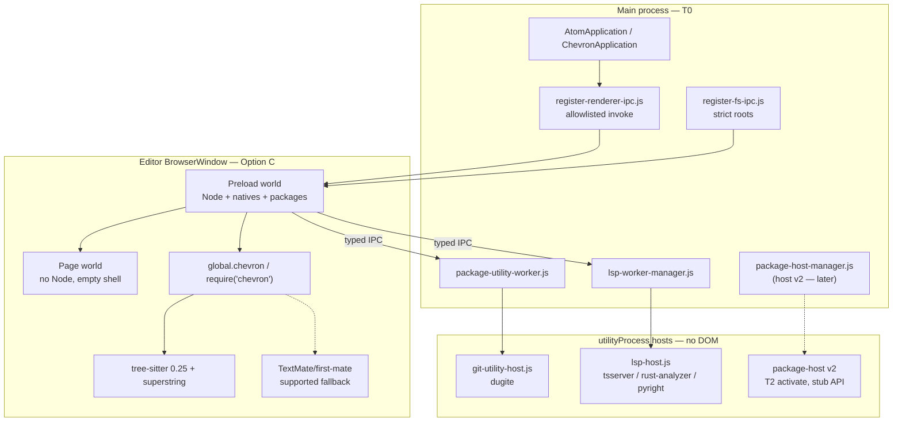
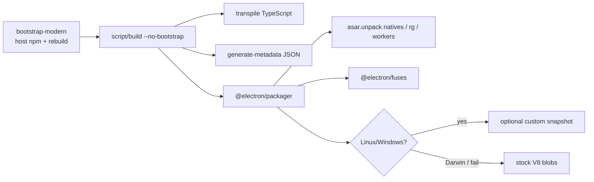

# Chevron architecture modernization

| Field | Value |
|-------|-------|
| **Author** | Grok (architecture audit) |
| **Date** | 2026-08-15 |
| **Status** | Draft (rev 3 — owner Q1–Q10 resolved 2026-08-15) |
| **Product** | Chevron 1.0.1 unsigned preview (`builtbygio/chevron`) |
| **Baseline** | Electron **43.1.0**, Node 24, Phase S Option C shipped, owned catalog only |
| **Audience** | Senior engineers who know this tree |
| **Type** | Strategy + target architecture + incremental PR plan — not a rewrite charter |

---

## Overview

Chevron already survived the hard Electron ladder. It is not Atom 1.60 on Electron 11. It is a **hackable Electron 43 editor** with `contextIsolation`, no `@electron/remote`, cpm instead of Node-12 apm, official tree-sitter 0.25, a utilityProcess LSP host, and an owned package catalog. The remaining problem is not “we are behind Electron.” It is that **several load-bearing subsystems still implement 2015 Atom’s *way of building an editor***: CSON-as-config, `child_process.fork` Task workers, TextMate + NAN oniguruma as a first-class language engine, `electron-packager@15` + custom `mksnapshot` heroics, a compile-cache that still *names* Coffee/Babel, Jasmine-in-Electron as the product test, and a GitHub package frozen on React 16 / Relay 5.

This document proposes a **target architecture** that keeps the product thesis — packages, `require('chevron')`, inspectable runtime, editor Chromium `sandbox: false` (Phase S Option C) — and replaces the dead patterns with 2026-effective ones. The method is Chevron-shaped increments: delete what has a modern replacement, wrap what still earns its keep, migrate the rest over years. It is **not** a Pulsar rebase, **not** a Rust/Avalonia rewrite, and **not** flipping `sandbox: true` as modernization.

The north star is a **language-server-first, tree-sitter-default, TypeScript-first Electron editor** whose package platform is Chevron-only, whose community reopen waits on package host v2, and whose build/test/packaging stack no longer depends on Atom-era tools that do not pay. TextMate remains a **supported fallback** for catalog languages that have no official grammar yet; first-mate is not deleted by this plan’s PRs.

---

## Background & Motivation

### What is already modern (do not re-litigate)

The 2025–2026 work already purged the worst Atom-era *runtime* debts. Treat these as locked:

| Locked | Evidence |
|--------|----------|
| Electron 43.1.0 + in-app Node ~24 | Root `package.json` `electronVersion`; `GROK.md` |
| Page world: `nodeIntegration: false`, `contextIsolation: true` | `src/main-process/atom-window.js` ~184–210 |
| Editor `sandbox: false` **intentional** (Option C) | `docs/security-phase-s-decision.md`; `src/preload-natives.js` `phaseSDecision` |
| No `@electron/remote`; `src/remote-compat.js` + `register-renderer-ipc.js` | `static/preload.js` 32–35; `docs/remote-ipc-inventory.md` |
| Guest `<webview>` sandboxed; git workers in `utilityProcess` | Phase S3; `src/main-process/package-utility-worker.js` |
| T2 community privileged/native `require` restricted by default | `src/package-require-audit.js`; `core.restrictCommunityPackageRequires` |
| cpm Phases 0–4; apm is a shim | `docs/cpm-design.md`; `cpm/` |
| Chevron-only API policy | `docs/REBRANDING.md`; `exports/atom.js` warns once |
| Owned catalog only until host v2 | `docs/package-ecosystem-strategy.md` |
| Official `tree-sitter@0.25.1` (N-API); DeeDeeG 0.17 deleted | CHANGELOG / #125 |
| First-party Coffee/CSON **gone from the monorepo tree** | `find` over `src/`, in-repo `packages/`, `keymaps/`, `menus/` (excluding `node_modules`) is empty. **Owned git pins still ship ~70 `.cson` files** (mostly `language-*` grammars/settings/snippets) — see Pillar 3 |
| Runtime Coffee/Babel compilers **gone** | stubs deleted (PR 11); TypeScript + CSON remain |
| LSP phases 0–5 shipped (utilityProcess host + workspace trust) | `docs/lsp-design.md`; `src/lsp/`; `src/main-process/workers/lsp-host.js` |
| Custom V8 snapshot on Linux/Windows; Darwin stock | `script/lib/packaging-policy.js` `darwin-boot-crash`; #121/#125 |
| 0 `atom/*` app git pins | #79; `docs/package-ownership-inventory.md` |

`docs/atom-architecture.md` is **stale** on several of these (still describes apm Node 12, `out/Atom.app`, community packages under `~/.atom`). Do not treat it as the current model. This document supersedes it as the architecture target.

### Why a plan, not a patch list

The product owner’s fear is correct in one specific way: **modernization-by-ladder** (Electron 11 → 43, Coffee → JS, atom.io → Pulsar) can leave the *shape* of the system unchanged. Atom’s shape was:

1. One privileged renderer (later: preload world) loads every package via `require()`.
2. Config, keymaps, grammars, menus are CSON/TextMate artifacts discovered on disk.
3. Heavy work is a forked Node `Task` with a fake DOM (`task-bootstrap.js`).
4. Startup is a custom V8 snapshot of a linked CJS graph (`electron-link` + `mksnapshot`).
5. Tests are Jasmine in a real Electron window plus Mocha in main.
6. GitHub UI is a Facebook-era React + Relay app living as a bundled package.

That shape was brilliant in 2015. In 2026 the effective editors (VS Code, Zed, modern Electron apps) do **language servers out of process**, **tree-sitter (or equivalent) for syntax**, **TypeScript as the source language**, **JSON/JSONC config**, **ripgrep for search**, **utilityProcess / extension host isolation**, and **no custom isolate snapshots unless measured**. Chevron already has the first of those (LSP). It still *is* the last five in too many places.

### Pain points (measured, not vibes)

| Pain | Fact |
|------|------|
| Cold start on old Mac | ~7.8 s median wall; 3 s in `setup-window` → `initialize` (`docs/startup-snapshot-plan.md` §4.1) |
| Linux is already fine | ~2.1 s stock; custom snapshot kills the require interval (327 → 11 ms) but workspace-ready is a wash because `AtomEnvironment` still constructs at runtime (§4.8) |
| Snapshot is a Darwin landmine | #125 generated a valid ~17/19 MB pair then smoke died at boot (`packaging-policy.js` 25–30) |
| Compile cache writes, barely helps | 6.0 MB blob, 1395 keys, warm −6% — execute, not compile, dominates |
| `github` is a 2019 SPA | `react@16.12.0`, `react-relay@5.0.0`, `graphql@14.5.8` (`node_modules/github/package.json`) |
| Search has two engines, and the **UI default is scandal** | `Workspace.scan` uses ripgrep only if `options.ripgrep` is truthy (`src/workspace.js` 2060–2062). `find-and-replace` always passes `ripgrep: atom.config.get('find-and-replace.useRipgrep')`, and that schema **defaults to `false`** (`node_modules/find-and-replace/package.json`). Flipping the core default alone does not change product find-in-project |
| `Task` still runs product features | Not a search leftover. Callers: fuzzy-finder path crawl (`node_modules/fuzzy-finder/lib/path-loader.js` `Task.once`), symbols-view ctags (`node_modules/symbols-view/lib/tag-reader.js`), `Workspace.replace` → `src/replace-handler.ts` → scandal `PathReplacer` (`src/workspace.js` ~2213) |
| Packager is Atom-era | `electron-packager@^15.1.0` in `script/package.json`; `@electron/packager` explicitly deferred |
| Test split is inverted | Fast `node --test script/ci/*` is the PR gate; `script/test` Jasmine+Mocha is nightly, not a merge gate, and first nightlies are measurement (`docs/jasmine-ci.md`) |
| Docs still teach Atom | `cpm-design.md` still says “dual-support forever”; `package-node-policy.md` still tells authors to use `Task`; `atom-architecture.md` still lists apm Node 12; `exports/chevron.js` header still says `require('atom')` exists “so community packages keep working” |

### Named leftovers (G1 inventory)

Every leftover named here has a delete / wrap / migrate verdict. Items missed in rev 1 are marked **rev 2**.

| Leftover | Where | Verdict |
|----------|-------|---------|
| `electron-packager@15` | `script/package.json` | **Migrated** to `@electron/packager` 18.4.4 (PR 6) |
| Custom `mksnapshot` | `script/lib/generate-startup-snapshot.js`; Darwin `packaging-policy.js` | **Wrap** — Linux/Windows on, Darwin stock; drop if `electron-link` dies |
| asar unpack | `package-application.js` 322–340 | **Keep** |
| Preload Node + Option C | `atom-window.js` 184–210 | **Keep** |
| `document-register-element` | `static/index.js` 171–184 | **Wrap** until catalog + etch/React host tags use a factory or a preload `createElement` patch; **do not delete** after a `src/` grep (Pillar 5) |
| `atom-*` custom element names | core + packages | **Migrate later** (branding, after polyfill strategy) |
| first-mate + oniguruma NAN | `grammar-registry.js`, `text-mate-language-mode.js` | **Wrap** as supported fallback; lazy-load; delete only if exception list is empty (optional H3) |
| `tree-sitter@0.25.1` | app dep | **Keep** |
| TextMate-only catalog languages | yaml, xml, php, sql, toml, less/sass, perl, clojure, csharp, objective-c, gfm, git, todo, coffee-script, ruby-on-rails, … | **Migrate** via an H2 grammar-port **stream**; until then they **are** the exception list |
| scandal search (`scan-handler.ts`) | `DefaultDirectorySearcher` | **Deleted** (PR 4) |
| scandal replace (`replace-handler.ts`) | `Workspace.replace` | **Migrated** (PR 3; JS RegExp via Task) |
| Public `Task` | `exports/chevron.js`; `src/task.ts` | **Wrap** until owned callers migrate; **not** a synonym for search (D16) |
| `vscode-ripgrep@1.9.0` | app + fuzzy-finder | **Keep**; rename to `@vscode/ripgrep` only after `rgPath` + unpack + `ensure-ripgrep` + fuzzy-finder pin verify (PR 15, not coupled to 2b) |
| Preload `spawn(rg)` | `src/ripgrep-directory-searcher.js` 1, 285 | **Migrate** to allowlisted main spawn + `invoke` in H1 (PR 2b). No new utilityProcess. No `sandbox: true` |
| season / pin CSON (~70 files) | `language-*` git pins; `transpile-cson-paths.js` is **live** | **Wrap** JSON+CSON reader until pins convert; **do not** delete season after a user-config window |
| User `config.cson` | `src/config-file.js` | **Migrated** (PR 5: JSON default, dual-read CSON) |
| Coffee/Babel compile-cache stubs | `src/coffee-script.js`, `src/babel.js` | **Deleted** (PR 11) |
| `transpileCsonPaths()` | `script/build` 108 | **Keep** until pins are JSON |
| `transpileCoffeeScriptPaths` / `transpileBabelPaths` | `script/build` | **Deleted** (PR 10; were quiet no-ops) |
| script `babel-core@5`, coffeelint, donna/joanna/tello, npm@6 | `script/package.json` | **Delete only if** a CI-invocation grep shows unused. donna/tello still required by `script/lib/generate-api-docs.js`; coffeelint by `script/lib/lint-coffee-script-paths.js` |
| Mocha + Jasmine-in-Electron | `script/test`, `vendor/jasmine.js` | **Wrap** as compatibility harness |
| github React 16 + Relay 5 | `node_modules/github/package.json` | **Migrate** as an **epic** (inventory → one surface → drop Relay), not two PRs |
| `remote-compat` + `sendSync` | `src/remote-compat.js`; inventory §11 | **Wrap**; S4 is inventory + **one slice** per PR |
| Package activate/services/keymaps | `src/package.js` | **Keep** |
| Config schema / LESS / scoped keymaps | `config-schema.js`, `less-compile-cache.ts` | **Keep** the model |
| `Package.getType()` returns `'atom'` | `src/package.js` 87–89 | **Migrate** in branding PR (H2) |
| Windows intermediate `package.json` `name` = `atom` / `atom-<channel>` | `script/lib/generate-metadata.js` 12–20 (comment: “dual-support installs”) so userData stays on Atom trees | **Wrap** until an explicit H3 userData migrate. **Not** H1 packaging |
| `src/electron-shims.js` | Grim-wraps `path.dirname`/`extname`/`basename` **and** `electron.remote.require` aliases | **Split**: path wraps ≠ remote shim deletion |
| `exports/atom.js` / `global.atom` / `atom://` / `apm` | various | **Wrap** until dedicated H3 shim-removal PR (N8) |
| `docs/atom-architecture.md`, `cpm-design.md` “dual-support forever” | docs | **Delete** the teaching — **PR 1 (this change)** |

---

## Goals & Non-Goals

### Goals

| ID | Goal |
|----|------|
| G1 | Name every **actual** leftover Atom-era architecture still in the tree, with file paths and a delete / wrap / migrate verdict. |
| G2 | Define a **target process + package + language + build** architecture that a 2026 engineer would recognize as current, without abandoning hackability. |
| G3 | Keep product surfaces: `global.chevron`, `require('chevron')`, `engines.chevron`, `~/.chevron`, owned catalog, inspectable preload runtime. |
| G4 | Make **LSP + tree-sitter** the language story **where an official grammar exists**. TextMate/oniguruma stay a **supported fallback** for the explicit exception list. Deleting first-mate is optional H3 and is **not** implied by this plan’s PRs. |
| G5 | Make **ripgrep** the only `Workspace.scan` implementation (product find-in-project = find-and-replace pin). **Spawn `rg` from main**, not preload (PR 2b). Move `Workspace.replace` off scandal. Keep **`Task` as a wrap-only worker** until owned callers (fuzzy-finder, symbols-view, replace) are migrated to `rg` or `utilityProcess`. |
| G6 | Make **JSON (user config) + TypeScript (source) + node:test (CI)** the default authoring/test path. Pin CSON stays until those packages are converted. Coffee/Jasmine-in-Electron stop being load-bearing. |
| G7 | Replace `electron-packager@15` with `@electron/packager`; stop treating custom V8 snapshots as a product identity. |
| G8 | Sequence work as **independently reviewable PRs** on `master` (no force-push). Epics (github slim, host v2, grammar ports, pin CSON) are **streams of PRs**, not one merge. |

### Non-goals

| ID | Non-goal | Why |
|----|----------|-----|
| N1 | Rebase onto Pulsar | Locked product decision (`GROK.md`, this prompt). Pulsar is a compatibility fork, not a 2026 architecture. |
| N2 | Flip editor `sandbox: true` | Option C is the end state for *this* architecture (`docs/security-phase-s-decision.md`). Security is T2 restrict + guests + IPC + utilityProcess + fuses. |
| N3 | Invent Atom dual-support as a goal | Chevron-only. `global.atom` / `require('atom')` / `engines.atom` / `atom://` / `apm` are unsupported shims slated for removal, not a product. |
| N4 | Rewrite the editor in Rust / Avalonia next | Avalonia remains a long-horizon spike (`GROK.md`). No justified path from today’s dogfood week to a second product. |
| N5 | VS Code extension API (`vscode.languages.*`) | LSP already chose Chevron services (`chevron.lsp`, `lsp.diagnostics`). Do not grow a second platform. |
| N6 | Open community install before host v2 | `docs/package-ecosystem-strategy.md`. cpm/Pulsar client may stay in-tree; product UX must not promise a store. |
| N7 | Big-bang ESM conversion of `src/` | Runtime stays CJS until a real ESM loader exists. Incremental TypeScript emit-to-CJS is the path. |
| N8 | Hard-delete remaining Atom name shims in the first PR | Dedicated removal PRs after owned packages and docs no longer need them (`GROK.md` “explicitly out of scope”). |
| N9 | Force-push `master` | Implementation is PR-sized. |

---

## Proposed Design

### One-sentence target

**Main** owns OS, IPC, supervised hosts, and (H1) the short-lived **`rg` child**. **Editor preload** owns the hackable UI + hot-path natives (Option C). **Semantics** live in the LSP utilityProcess. **Syntax** is tree-sitter in-process. **Packages** are Chevron services activated in-process (T0/T1) or, later, in a restricted host (T2). **Build** is host npm + `@electron/packager` + optional snapshot. **Config is JSON. Tests are node:test first.**

### Target process model



This is the **current** model plus one planned box (package host v2). H1 also moves **`rg` spawn** from preload into Main (allowlisted, not a new host box). The modernization is not a new process topology. It is **stopping the preload world from being a 2015 kitchen sink**.

### Current boot (what we keep)

```text
main.js → start.js → AtomApplication
  → AtomWindow (preload=static/preload.js, sandbox:false)
    → preload.js
         installPackageRequireAudit()
         electron.remote = remote-compat   // shrink, do not grow
         require('./index.js')
    → index.js onload
         NativeCompileCache + blob-store
         document-register-element         // migrate off
         season CSON cache                 // migrate off
         initialize-application-window.js
            installEnvironment()
              global.chevron = new AtomEnvironment
              global.atom = same           // unsupported alias
              preloadPackages()            // first-paint only
            startEditorWindow()
```

Keep the preload-world boot. It is the honest hackable-Electron design: the page is a shell; the isolated world has Node; guests never get it. That is **more modern than 2018 Atom** (`contextIsolation: false`, `@electron/remote`). Do not “modernize” it into a sandboxed page that cannot `require('chevron')`.

### Three horizons

Work is ordered so each horizon is a product that still boots.

| Horizon | Name | Product outcome | Calendar (indicative) |
|---------|------|-----------------|------------------------|
| **H1** | Purge what is actually dead | Docs match the tree; **product** find-in-project is ripgrep (find-and-replace pin); **`rg` spawned from main** (not preload); `Workspace.replace` off scandal; user config writes JSON; packager is `@electron/packager`; Coffee/Babel stubs gone; snapshot numbers published | After dogfood week (#106 Days 2–7) unless the owner OKs earlier. Independent tracks (packager, snapshot measure, docs, config writer) can land in parallel. **Do not** delete `Task`, `season`, or `document-register-element` in H1. **Do not** start Epic 18 / PR 19 until Days 2–7 answer Q1 |
| **H2** | Language-first + catalog hygiene | Tree-sitter ports for named TextMate-only languages **or** a written exception list with owners; first-mate lazy; pin CSON conversion stream; `github` work **only after Q1**; factory/catalog CE work; `Task` callers migrated then public `Task` removable | After H1 search/replace; Epic 18/19 blocked until dogfood says 8A/8C vs 8B |
| **H3** | Platform reopen | Package host v2 **epic** (owner-gated); first-mate removable **only if** exception list is empty; Atom name shims; Windows userData name; signing | After base Chevron is “done enough” (owner call) |

Avalonia / in-app AI stay **after H3** unless a separate funded spike says otherwise. AI already has a design (`docs/ai-design.md`) that correctly waits on LSP + Phase S invariants.

---

### Pillar 1 — Language stack: tree-sitter + LSP, TextMate as a shrinking fallback

**Today**

```text
GrammarRegistry
  ├── FirstMate.GrammarRegistry + oniguruma (NAN)     TextMate
  └── treeSitterGrammarsById + tree-sitter@0.25.1     official N-API
```

- `src/grammar-registry.js` constructs `new FirstMate.GrammarRegistry({ maxTokensPerLine: 100, maxLineLength: 1000 })`.
- `src/text-mate-language-mode.js` requires `oniguruma` `OnigRegExp`.
- `src/tree-sitter-language-mode.js` requires official `tree-sitter` + `superstring.Patch`.
- `src/preload-natives.js` lists **both** `oniguruma` and `tree-sitter` as `renderer-hot` — they are why sandbox stays false.
- `core.useTreeSitterParsers` already exists and re-scores buffers on change.
- LSP (`src/lsp/`) is the semantic layer and must stay **out of the renderer** (G1 in `docs/lsp-design.md`).

**2026 practice:** syntax is incremental tree-sitter (Zed, Neovim, VS Code semantic tokens on top of TextMate *or* tree-sitter). Semantics are LSP. Nobody starts a new editor on first-mate + oniguruma NAN.

**Today (coverage, not slogan)**

Authoritative catalog: [language-stack.md](./language-stack.md). 14 packages ship a tree-sitter grammar (13 also keep TextMate; rust is tree-sitter only). 19 are TextMate-only; `language-source` is settings only. 13b YAML and XML landed. Remaining first tranche: php, toml, sql. “keep TextMate” is a valid owner decision — that list is why first-mate stays.

**Target**

1. **Tree-sitter is the default highlighter** for every catalog language that has an official `tree-sitter-*` grammar. TextMate is the **supported fallback** for the exception list — not a shame state.
2. **H2 owns grammar ports** as a **stream of pin PRs** (yaml, xml, php, toml, sql first — high-traffic). Each port is its own reviewable PR. Languages nobody will port stay on the exception list with a named owner (“keep TextMate” is a valid owner decision).
3. **LSP is the only semantic path.** Do not revive `atom-languageclient` / `atom-ide-ui`. Do not spawn servers from packages.
4. **first-mate + oniguruma stay wrapped** behind `GrammarRegistry`. H2 lazy-loads them so a tree-sitter-only session does not boot oniguruma. **Deleting** them is optional H3 and is gated on an empty exception list. This plan’s PRs do **not** make first-mate die.
5. **ctags / `symbols-view`** stay as the no-server fallback (already LSP design N3). They still call `Task` (Pillar 2) — do not delete `Task` while this fallback is product.

**Delete / wrap / migrate**

| Piece | Verdict | When |
|-------|---------|------|
| `tree-sitter@0.25.1` + official grammars | **Keep** | Now |
| `src/lsp/**` + `lsp-host` | **Keep** | Now |
| New official grammars for TextMate-only catalog langs | **Migrate** (H2 stream) | Per-language PRs |
| TextMate grammars for langs that already have tree-sitter | **Delete** after a dogfood cycle proves colour/indent parity | H2, optional |
| `first-mate` + `oniguruma` | **Wrap** + lazy-load | H2. Delete only if exception list is empty (H3 optional) |
| `language-coffee-script` | **Exception-list** until someone cares | — |

Risk (**medium**): some TextMate scopes are load-bearing for snippets, autocomplete selectors, and `language-todo`. Mitigation: keep the TextMate *scope name* (`source.js`) as the public language id even when the highlighter is tree-sitter (already how `GrammarRegistry` maps `textMateScopeNamesByTreeSitterLanguageId`).

---

### Pillar 2 — Search, replace, and workers: three jobs, not one

`Task` is **not** a search-engine synonym. Three product jobs share Atom-era machinery:

| Job | Path today | Engine |
|-----|------------|--------|
| **Find-in-project (UI)** | `find-and-replace` → `workspace.scan` → `RipgrepDirectorySearcher` | Ripgrep only (PR 2 + PR 4). `atom.directory-searcher` providers can still override a directory. `useRipgrep === false` / `CHEVRON_SEARCH_ENGINE=scandal` no longer select a second engine |
| **Project replace** | `find-and-replace` → `workspace.replace` → `Task.once(replace-handler)` → `replace-in-files.js` | JS `RegExp` (PR 3). Open buffers in-process; other files via Task. No scandal |
| **Quick-open crawl** | `fuzzy-finder/lib/path-loader.js` `const {Task} = require('chevron')` + `Task.once(load-paths-handler)` | Already has its own `fuzzy-finder.useRipGrep` (**default `true`**). Still **requires `Task`** to run either crawler |
| **Go-to-symbol (no LSP)** | `symbols-view/lib/tag-reader.js` `Task.once(handlerPath, …)` | ctags in a `Task`. Pillar 1 **keeps** this fallback (LSP N3) |

`Task` itself (`src/task.ts`) is `ChildProcess.fork` of `task-bootstrap.js` (fake `document` / `console`). It is exported from `require('chevron')` (`exports/chevron.js` 42). Remaining callers: fuzzy-finder, symbols-view, `Workspace.replace`.

`vscode-ripgrep@1.9.0` is in app deps (npm name **deprecated**). Bootstrap downloads `rg` because `--ignore-scripts` skips the package fetch. Fuzzy-finder also depends on `vscode-ripgrep`. Git/LSP already use `utilityProcess`. Search/replace/crawl did not.

**2026 practice:** ripgrep for search. Long jobs are `utilityProcess` or a short-lived `rg`/`ctags` child — not a renderer-forked Node with a sham DOM.

**Target (ordered)**

1. **Product find-in-project = find-and-replace pin.** Flip `find-and-replace.useRipgrep` default to `true`, drop “experimental” copy. Also flip the core `Workspace.scan` default so callers that omit the flag get `rg`. One-release escape: **both** `find-and-replace.useRipgrep = false` **and** `CHEVRON_SEARCH_ENGINE=scandal`.
2. **`Workspace.replace` leaves scandal** (ripgrep `--replace` / in-process file rewrite that preserves the current iterator events) **before** anyone deletes `scandal` or `Task`.
3. **`DefaultDirectorySearcher` + `scan-handler.ts`** become dead after (1) and a dogfood window, then deleted. That is **search only**.
4. **`rg` spawn moves to main in H1 (PR 2b).** Today `RipgrepDirectorySearcher.searchInDirectory` does `spawn(this.rgPath, args, …)` in the preload (`src/ripgrep-directory-searcher.js` 1, 285). Target: allowlisted main-process spawn + `ipcRenderer.invoke` (stream results back). **Not** a new `utilityProcess` host — short-lived `rg` is a child of main, same shape as other allowlisted spawns. Does **not** flip `sandbox: true`. Keep `resolveRgPath()`, asar unpack `node_modules/vscode-ripgrep/bin/**`, and bootstrap `ensure-ripgrep`. Keep the existing JSON-lines adapter / JS RegExp / iterator events. Fuzzy-finder’s own `rg` crawl (still inside a `Task`) is **not** this PR.
5. **`Task` stays public and wrap-only** until fuzzy-finder and symbols-view pins no longer call it **and** replace no longer uses it. Those are **owned-pin PRs**, not a Grim.deprecate commit. After callers are gone, delete `Task` from `exports/chevron.js` (H2). Preferred successor for remaining long jobs: **main-owned `utilityProcess`** (Alternative A7) if a pin stalls (Q9).
6. **`BufferedNodeProcess` / `BufferedProcess`** stay.
7. Rename `vscode-ripgrep` → **`@vscode/ripgrep` only after** verifying `rgPath`, asar unpack `node_modules/vscode-ripgrep/bin/**`, `script` `ensure-ripgrep`, and the fuzzy-finder pin (PR 15). Not assumed drop-in. **Do not couple PR 2b to PR 15.**

**Delete / wrap / migrate**

| Piece | Verdict |
|-------|---------|
| `src/ripgrep-directory-searcher.js` | **Keep** the adapter; **migrate** `spawn` to main (PR 2b) |
| `find-and-replace.useRipgrep` default | **Migrate** to `true` (this is the product switch) |
| `DefaultDirectorySearcher` + `scan-handler.ts` | **Deleted** (PR 4) |
| `replace-handler.ts` + scandal `PathReplacer` | **Migrated** (PR 3) |
| `scandal` dep | **Deleted** (PR 4; scan and replace both off it) |
| `Task` / `task-bootstrap.js` / `exports/chevron.js` `Task` | **Wrap** through H1; **delete** after owned callers migrate (H2) |
| `vscode-ripgrep` | **Keep**; rename later with verification |

Risk (**high** if we delete early): landing “delete Task + scandal after a dogfood day of ripgrep” breaks quick-open, go-to-symbol, and project replace. The owned catalog **is** the caller. Alternative A6 (“we can break `Task`”) is rejected.

---

### Pillar 3 — Config, keymaps, menus: JSON is the format

**Today**

- In-repo first-party `keymaps/*.json`, `menus/*.json`, and monorepo package keymaps/menus/snippets are **already JSON** (CHANGELOG owned-catalog pass). That is **not** the whole catalog.
- **Owned git pins still ship CSON.** Counted 2026-08-15: **70** `.cson` files at pin depth (not nested `node_modules`). Almost all `language-*`:

  | Pin | `.cson` files |
  |-----|--------------:|
  | `language-ruby-on-rails` | 6 |
  | `language-sass`, `language-objective-c`, `language-git`, `language-csharp` | 5 each |
  | `language-xml`, `language-property-list`, `language-php`, `language-perl`, `language-coffee-script` | 4 each |
  | `language-clojure` | 3 |
  | `language-yaml`, `language-toml`, `language-todo`, `language-text`, `language-sql`, `language-mustache`, `language-make`, `language-less`, `language-hyperlink`, `language-gfm` | 2 each |
  | `language-source` | 1 |

  Plus ~38 of those are `grammars/*.cson`. `docs/owned-package-modernization-checklist.md` already lists “CSON → JSON for keymaps/menus/grammars/snippets” as **iterative per-package** work.

- **`script/build` still runs `transpileCsonPaths()`** (`script/lib/transpile-cson-paths.js`, invoked at `script/build` 108). This is **not** a Coffee/Babel no-op. Packaged apps convert pin CSON → JSON at pack time. Dev / `--resource-path` loads raw pin files via **season**.
- Runtime season call sites (not just user config): `src/config-file.js`, `src/package.js`, `src/package-manager.js`, `src/grammar-registry.js`, `src/compile-cache.js`, `src/keymap-extensions.ts`, `src/menu-manager.ts`, `src/context-menu-manager.ts`, `src/main-process/start.js`, `src/main-process/main.js`, `src/main-process/lsp-command-policy.js`, `static/index.js` CSON cache.
- `src/config.js` + `src/config-schema.js` + `scoped-property-store` are the **Atom-invented settings model**. This model is *fine*. The **user** file format is H1 debt; the **pin** format is an H2 stream.

**2026 practice:** JSON or JSONC user settings (VS Code). TOML is fashionable and not worth a third parser. YAML is how you get the CSON problem again.

**Target**

1. **Keep the schema/observe/scoped model.** Do not invent a new settings API.
2. **Default user files are JSON:** `~/.chevron/config.json`, `keymap.json`, `snippets.json`, `styles.less`.
3. **Dual-read for one release:** if `config.cson` exists and `config.json` does not, read CSON and write JSON on next save. Then stop **writing** CSON. **Keep reading** CSON for package grammars/settings/snippets until pins convert.
4. **`season` stays in the app runtime** (wrap) until the pin conversion stream is done **or** pack-time `transpile-cson-paths` + a **dev-only** season path is the remaining reader. Do **not** write “inventory says no.”
5. `core.themes` default still names `one-dark-*`; product default should move to `chevron-dark-ui` / `chevron-dark-syntax` in a dedicated PR (branding, not architecture).

**Delete / wrap / migrate**

| Piece | Verdict |
|-------|---------|
| Config schema + scoped store + observe API | **Keep** |
| User `config.cson` / `keymap.cson` | **Migrated** (PR 5; dual-read CSON, `season` stays) |
| Pin `.cson` (~70) | **Migrate** per-package (H2 stream); checklist already says this |
| `transpile-cson-paths.js` | **Keep** until pins are JSON |
| `season` | **Wrap** until pins + user dual-read are done; then **delete** |
| LESS themes + `less-cache` | **Keep** |
| `document-register-element` | See Pillar 5 |

---

### Pillar 4 — Module system and compile-cache: TypeScript-first, CJS runtime, no hero transpilers

**Today**

- `src/` is **159 JS + 15 TS**. New owned packages already use TS (`packages/autoflow/lib/autoflow.ts`, `language-rust-bundled`).
- Runtime is **CommonJS `require()` everywhere**. `exports/` is on `module.globalPaths` (`initialize-application-window.js` 70–73) so `require('chevron')` resolves.
- `src/compile-cache.js` still registers compilers for `.js` (Babel-prefix detector that **throws**), `.ts`/`.tsx` (TypeScript 6 `transpileModule` → CJS), `.coffee` (throws).
- `src/module-cache.js` is Atom’s boot-time dependency resolver (avoids walking `node_modules`).
- `src/native-compile-cache.js` + `file-system-blob-store.js` cache V8 code; measured warm-start win is ~6%.
- `script/build` invokes `transpileTypeScriptPaths()` and **`transpileCsonPaths()`** (live: owned-pin `.cson` → `.json` at pack). Coffee/Babel no-op transpile is gone (PR 10). Do not delete `transpile-cson-paths.js` as Coffee archaeology.
- `script/package.json` still depends on **`babel-core@5.8.38`**, **`coffeelint@1.15.7`** (still required by `script/lib/lint-coffee-script-paths.js`), **`donna` / `joanna` / `tello`** (still required by `script/lib/generate-api-docs.js` — not referenced from current CI greps), **`npm@6`** (no `require('npm')` in `script/**/*.js`; likely leftover, unproven), **`season@5.3.0`**.

**2026 practice:** TypeScript as source, emit or load CJS/ESM explicitly, no runtime Coffee/Babel 5, no custom compile-cache for first-party code in production (precompile at pack). ESM is the language default; Electron can load it, but a snapshot linker and a `require('chevron')` package API are CJS-shaped.

**Target**

1. **Runtime stays CJS** for the editor and for `require('chevron')`. That is the hackable API. Do not break it for fashion.
2. **First-party production JS is precompiled.** Packaged app should not need compile-cache for `src/` or bundled packages. TypeScript compile-cache remains for **dev** and for owned packages that ship `.ts` (current policy).
3. **Coffee/Babel stubs stay one more release** so a leftover community file gets a clear error, then they are deleted from `COMPILERS` and `CHEVRON_DISABLE_LEGACY_TRANSPILE` becomes a no-op.
4. **New `src/` files are TypeScript.** No mass rename. Convert on touch. Ban new `.js` in `src/` via CI once H1 lands (optional, owner call).
5. **ESM packages** (e.g. `tree-sitter-css@0.25`) load through the existing `node-gyp-build` / dynamic-import seam (`load-tree-sitter-language.js`). Do not make the whole app `"type": "module"`.
6. **Strip script-tree fossils only after a CI-invocation grep.** Gate `donna`/`tello`/`coffeelint` on whether generate-api-docs / lint-coffee still run in CI. Do not delete `transpile-cson-paths.js` as “Coffee archaeology.”

**Delete / wrap / migrate**

| Piece | Verdict |
|-------|---------|
| `require('chevron')` CJS export | **Keep forever** (product API) |
| TypeScript compile-cache | **Keep** (dev + `.ts` packages) |
| NativeCompileCache / blob-store | **Keep** (cheap; measured) |
| Coffee/Babel compile-cache entries | **Delete** after error-window |
| `transpile-cson-paths.js` | **Keep** until pins are JSON |
| `module-cache.js` | **Wrap** (still pays at boot); revisit after snapshot decision |
| script `babel-core@5` | **Delete** if unused (no-op transpile) |
| coffeelint / donna / joanna / tello | **Keep** until CI-invocation grep says unused |
| `npm@6` in `script/` | **Delete** if grep confirms no require |
| Full ESM rewrite | **Won't** |

---

### Pillar 5 — DOM and custom elements: factory first; polyfill stays until the catalog does

**Today**

- Chromium in Electron 43 has Custom Elements v1.
- `contextIsolation` means `customElements.define()` in the preload realm does **not** upgrade `document.createElement('atom-pane')` / parser-created nodes in the shared document.
- That is why `document-register-element@1.14.10` is still required (`static/index.js` 171–184; GROK.md landmine: “Skip `document-register-element` → breaks `document.createElement('atom-*')`”).
- `src/create-custom-element.js` already constructs via `new ElementClass()` to force the preload constructor.
- Parser-inserted tags are gone (`static/index.html` is an empty shell). **Package-constructed** tags are why the polyfill still exists.
- First-party construction uses `createCustomElement` / factories (PR 7). `menu-manager.ts` still builds a **test document** via `testDocument.createElement` for selector matching — not a live host tag.
- Owned pins still construct host tags the same way (`notifications` `atom-notification` / `atom-notifications`, `markdown-preview` `atom-styles`, github React `createElement("atom-text-editor")`). **Etch and React go through `document.createElement`**, so a CI grep of `src/` + monorepo packages is not the full set.
- Core tags still use the `atom-*` prefix. That is a name, not an architecture.

**2026 practice:** native custom elements. No `document-register-element`. Getting there without blanking notifications / github / markdown-preview is the work.

**Target**

1. **H1 PR is factory-only.** Convert first-party `createElement('atom-*')` sites to `createCustomElement` / `new FooElement()`. Add a CI grep for `src/` + monorepo `packages/`. **Do not delete the polyfill in that PR.** Smoke that never opens notifications / github / markdown-preview will look green and then mis-style those UIs.
2. **H2 follow-on** converts owned-pin host tags (notifications, markdown-preview, github) **or** installs a preload `document.createElement` patch that upgrades `atom-*` / later `chevron-*` tags in the isolated world (Alternative A8). Only then delete `document-register-element`.
3. **Do not Grim-wrap `registerElement`** (already learned in #108).
4. **Tag rename `atom-*` → `chevron-*` is a separate, late PR.** Do not combine with factory conversion or polyfill delete.
5. **etch@0.14.1** stays. Replacing the editor component is a multi-year rewrite.

**Delete / wrap / migrate**

| Piece | Verdict |
|-------|---------|
| `create-custom-element.js` | **Keep**; first-party sites converted (PR 7) |
| `document-register-element` | **Wrap** through H1; **delete** only after catalog + etch/React host tags are covered |
| etch + `TextEditorComponent` | **Keep** (wrap) |
| `atom-*` tag names | **Migrate later** (branding) |

---

### Pillar 6 — IPC: remote-compat is a shrinking shim, not an API

**Today**

- `static/preload.js` and `static/index.js` both assign `electron.remote = require('../src/remote-compat')` if missing.
- `src/remote-compat.js` (373 lines) emulates Menu, BrowserWindow (including **constructor for github workers**), webContents — mostly via `sendSync`.
- `src/fs-ipc-client.js` and parts of `application-delegate.js` still `sendSync`.
- Phase S explicitly **deferred** S4 sendSync→invoke (`docs/security-phase-s-decision.md` exit table).
- The **preferred** surface is already `src/renderer-ipc.js` + `src/application-delegate.js` + `register-renderer-ipc.js` (1057 lines of allowlisted handlers).

**2026 practice:** typed `ipcMain.handle` / `ipcRenderer.invoke`. No `electron.remote`. Sync IPC only for the handful of boot reads that cannot be async (load settings).

**Target**

1. **New code never touches `electron.remote`.** CI grep in `src/` and owned packages.
2. **S4 is inventory + one slice per PR**, not “migrate non-boot sendSync” in a single merge. `docs/remote-ipc-inventory.md` §11 is the row list:

   | §11 area | Representative channels | H1–H2 move? |
   |----------|-------------------------|-------------|
   | Boot | `atom-window-load-settings-sync`, `atom-window-startup-markers-sync` | **Stay sync** until inject-at-preload exists |
   | Window / webContents proxy | `atom-bw-id-call-sync`, `atom-wc-is-destroyed-sync`, … | **Stay** while `remote-compat` is the github/worker proxy |
   | Dialogs / display | `atom-show-message-box-sync`, … | **First slice** if callers can go async (`confirm` is the hard one) |
   | App / clipboard / shell | `atom-app-get-*-sync`, `atom-clipboard-*-sync` | **Second slice** where callers are already async |
   | Workers | `atom-create-browser-window-sync`, … | **Deleted** (PR 9). utilityProcess only |
   | FS IPC | `atom-fs-*-sync` family | **Do not** migrate in the same merge as remote-compat shrink. #108 is a measured footgun |

3. **H1 S4 PR** = refresh §11 + deprecate `exports/remote.js` + **one** slice (dialogs *or* clipboard that already have async callers). Do not promise remote-compat shrinkage **and** FS migration in one PR. github still uses `electron.remote` (`git-timings-view.js`, `directory-select.js`) until the github epic.
4. **Worker BrowserWindow constructor** stays until dogfood confirms utilityProcess (PR 9).
5. New channels are named `chevron:*` and documented in §11.

**Delete / wrap / migrate**

| Piece | Verdict |
|-------|---------|
| `renderer-ipc.js` + allowlisted main handlers | **Keep** |
| `remote-compat.js` | **Wrap**; shrink one slice at a time |
| `exports/remote.js` | **Deprecate** H1; **delete** after github epic + PR 9 |
| FS `sendSync` | **Separate** PR after tree-view/fuzzy-finder are known-safe |

---

### Pillar 7 — Packages: keep the Atom *model*, purge the Atom *worldview*

The package system **is** Chevron’s product. Do not replace it with VS Code extensions.

**Keep (this is hackability)**

| Mechanism | Where | Why it stays |
|-----------|-------|----------------|
| Directory + `package.json` + `activate` / `deactivate` | `src/package.js` | Inspectable, reloadable, forkable |
| Services (`provide*` / `consume*` via `service-hub`) | `src/package-manager.js` | LSP already uses this (`chevron.lsp`, `lsp.diagnostics`) |
| `activationCommands` / `activationHooks` / URI openers | `src/package.js` 1044+ | Lazy activation is correct |
| Keymaps, menus, styles, grammars, settings as package files | `Package.load*` | The hackable surface |
| `packageDependencies` map | root `package.json` (94 entries) | Runtime catalog, not an npm feature |
| Deferred first-paint set | `src/deferred-startup-packages.js` | Measured −480 ms workspace-ready |
| T2 require restrict | `package-require-audit.js` | Host v1 |

**Change**

1. **Product API is `require('chevron')` / `global.chevron` only.** `exports/atom.js` stays as a one-shot warning until a dedicated shim-removal PR. Owned packages already migrated (`owned-require-chevron.test.js`). PR 1 edits the `exports/chevron.js` header that still says `require('atom')` exists “so community packages keep working.”
2. **`engines.chevron` is required** for catalog packages (already on forks). `engines.atom` alone is a cpm warning; after H2 it is a hard reject for *new* installs.
3. **Do not grow `packageDependencies` with curiosity packages.**
4. **github package** is the largest architecture tax inside the catalog (see Pillar 8) — an **epic**, not two PRs.
5. **Package host v2** remains the *later* isolation model. H1 does not implement it. H3 is an **epic** that implements the already-written `docs/security-phase-s-package-host.md` in several PRs after owner sign-off.
6. **`Package.getType()` still returns `'atom'`** (`src/package.js` 87–89). Fix in the H2 branding PR, not as a search/packager change.
7. **`src/electron-shims.js` is two things:** Grim-wraps on `path.dirname` / `extname` / `basename`, and `electron.remote.require` aliases. Delete the remote aliases with the remote-shim PR; leave path wraps until a dedicated deprecation pass (they are not “modernization”).

**Do not**

- Invent a `.vsix` / sealed artifact format in H1 (cpm can grow integrity later; the directory format is the hackable format).
- Promise Pulsar community install.
- Add a second activation model “for modern packages.” One model, cleaned.

---

### Pillar 8 — `github` package: stop shipping a 2019 Facebook SPA as core

**Today** (`node_modules/github/package.json`):

- `react@16.12.0` + `react-dom@16.12.0` + `react-relay@5.0.0` + `relay-runtime@5.0.0` + `graphql@14.5.8`
- `dugite@1.110.0` (git) — workers already on utilityProcess
- `keytar@4.13.0` (listed; app hoists owned keytar)
- Pre-transpiled CJS as of #125 (`atomTranspilers` gone)
- Deferred at startup (`DEFERRED_STARTUP_PACKAGES`)
- Still `engines.atom: >=1.37.0` plus `engines.chevron: *`

This package is why `process.env.NODE_ENV = 'production'` exists in `initialize-application-window.js` 75–78 (“Make React faster”). It is why asar unpack includes `github/lib/**`. It is the main remaining reason remote-compat still constructs BrowserWindows.

**Target (owner Q1 — decide after more dogfood):**

| Option | What | When it wins |
|--------|------|----------------|
| **8A Slim** | Keep Git status + blame + GitHub PR list via REST/`fetch`; delete Relay, GraphQL runtime, most of React. Reuse `lsp-ui` / etch / existing docks. | Dogfood Days 2–7 say we only need “git in the editor,” not the full inbox |
| **8B Upgrade** | React 18 + modern GraphQL client, still a bundled package | Dogfood says the inbox UI is **load-bearing** — do **not** start 8A/8C slimming that would delete it |
| **8C Split** | `chevron-git` (dugite + gutters, in-repo) + optional `chevron-github` (hosted API) | Follows 8A if dogfood chose git-in-the-editor |

**Do not start Epic 18 or PR 19 until #106 Days 2–7 answer Q1.** If the answer is 8A/8C, decompose 8A as an epic (not two master PRs):

1. Inventory remaining Relay routes + `electron.remote` sites (read-only PR).
2. Delete unused Relay routes / dead views.
3. Replace **one** surface (status or blame) with etch/`fetch`.
4. Repeat per surface.
5. Drop `react-relay` / `graphql@14` when unused.
6. Chevron pin bump (always a separate PR from the package-repo work).

H1 only: keep shipping `github`, keep it deferred, delete emergency BW workers if dogfood allows. No Relay/React slimming in H1.

---

### Pillar 9 — Build and packaging: `@electron/packager`, honest snapshots

**Today**

| Tool | Version / policy | Problem |
|------|------------------|---------|
| `@electron/packager` | `18.4.4` (`script/package.json`) | PR 6. 19+ is ESM-only; later bump |
| asar unpack | `*.node`, dugite, github `lib/**`, vscode-ripgrep, workers, icons (`package-application.js` 322–340) | Correct and **stays** — natives cannot live only in asar |
| `electron-link@0.6.0` + `electron-mksnapshot@43` | Linux/Windows custom; Darwin stock | Linker is unmaintained-looking; Darwin still crashes after a valid pair |
| Fuses | `RunAsNode` on (cpm); ASAR integrity **macOS only**; `OnlyLoadAppFromAsar` **off** (`flip-electron-fuses.js` 67–81) | Honest: unpacked natives + cpm require this |
| Bootstrap | `./script/bootstrap-modern` (host npm + `@electron/rebuild`) | This part is already modern |
| Signing | None (unsigned preview) | Product, not architecture |

**2026 practice:** `@electron/packager` (or `electron-builder` if you want installers; we already have custom deb/rpm/zip). VS Code does **not** bet the product on a custom V8 isolate snapshot of the app heap. Electron’s own snapshot story for apps is bit-rotting (`startup-snapshot-plan.md` open question 4).

**Target**

1. **Migrate packager** to `@electron/packager` in one PR stream. Same unpack globs, same fuses, same Linux dir shape (`Chevron-linux-<arch>`). This is packaging, not a product rewrite.
2. **Custom snapshot is an optimization, not an identity.**
   - Keep Linux/Windows **on** while the require-interval win is real on slow hosts.
   - Keep Darwin **stock** — **frozen** (Q2 / PR 12). Do not staff constructor-heap bisection (`AtomEnvironment` construction is what SIGTRAPs — §4.8 / §4.10).
   - Windows: shipping custom-snapshot number published (PR 12 / §4.9): GHA median wall 2,734 ms; workspace-ready 1,585 ms; require interval 15 ms. Keep custom (Q3).
   - **Do not** expand snapshot-time `require()` of packages. First-paint list is enough (`SNAPSHOT_STARTUP_PACKAGES`).
   - If `electron-link` breaks on a future Electron, **drop custom snapshots** rather than fork the linker. Lazy packages + compile cache + TS precompile are the durable path.
3. **Do not enable `OnlyLoadAppFromAsar`** while unpacked natives and cpm exist.
4. **Signing / notarization** is a release-engineering track, not architecture. When it happens, Squirrel feed may return; do not point it at unsigned bits (`docs/releases.md`).



---

### Pillar 10 — Tests: node:test is the architecture; Jasmine is a compatibility harness

**Today**

| Layer | Runner | When |
|-------|--------|------|
| Logic / contracts | `node --test script/ci/*.test.js` (~30 files) | Every PR |
| cpm | `cpm/test/*.test.js` | Every PR |
| Smoke | `script/ci/smoke-test.js` | Linux x64 every code PR; other platforms on build |
| Full editor | `script/test` → packaged binary → Jasmine renderer + Mocha main | Linux nightly + `jasmine` label (`docs/jasmine-ci.md`) |
| github | mocha 6 + enzyme-adapter-react-16 | Package-local, not the monorepo gate |

`package.json` still depends on `mocha@6.2.3`, `jasmine-reporters@1.1.0`, `jasmine-tagged`, `chai@4.3.4`, `sinon@9.2.1`. `vendor/jasmine.js` is vendored. `#127` restored the Jasmine runner after Coffee removal — that was **repair**, not a destination.

**2026 practice:** `node:test` (or vitest/jest for unit) on host Node; a small number of Playwright/Spectron-class smoke tests against the packaged app. Do not boot Electron to assert `Config.get`.

**Target**

1. **PR gate stays `unit-and-cpm` + smoke.** That is the modern test architecture. Grow `script/ci/*.test.js` for every new core module (LSP already does this well).
2. **`script/test` is a compatibility harness** for DOM/editor specs that truly need a window. It is not allowed to become a merge gate until it is green *and* fast. Nightly measurement continues (#57).
3. **Stop adding Mocha/Jasmine specs for new code.** New tests are `node:test`. Convert old specs when touching a file if they do not need a DOM.
4. **Main-process Mocha inside `script/test`** should shrink as those cases move to `script/ci`.
5. **github’s mocha/enzyme** dies with Pillar 8.

---

### Target `require('chevron')` surface

Keep a **small, documented** public module. Everything else is `global.chevron.*`.

```js
// exports/chevron.js — target after Task callers migrate (H2+)
module.exports = {
  // models
  TextBuffer, Point, Range,
  TextEditor,            // renderer only
  File, Directory,
  Notification,
  GitRepository,
  // events
  Emitter, Disposable, CompositeDisposable,
  // process (main-owned spawn)
  BufferedProcess,
  BufferedNodeProcess,
  // fs watch
  watchPath
  // Task: still exported in H1 (fuzzy-finder, symbols-view, replace).
  // Removed only after those pins no longer call it (PR 14a).
};
```

`WinShell` stays Windows-only and should move behind `applicationDelegate` rather than leaking main-process modules into the package export.

`global.chevron` remains the `AtomEnvironment` instance (class rename is cosmetic and late). Packages talk to `chevron.workspace`, `chevron.project`, `chevron.packages`, `chevron.commands`, `chevron.config`, `chevron.grammars`, `chevron.styles`, `chevron.themes`, `chevron.notifications`, `chevron.git`.

---

### What “hackable” means in the target

Hackable is **not** “every package gets `child_process` and `electron.remote`.” That was Atom’s 2015 slogan and it is how you get malware in `~/.atom/packages`. Chevron already rejected it for T2.

Hackable **is**:

- `~/.chevron/init.js` and user keymaps/styles still run in the preload world (T0 user, not T2 package).
- Owned / bundled packages can still `require('chevron')`, register services, add panes, add commands, add LESS, add grammars.
- Devtools inspect the **isolated world** where `global.chevron` lives (GROK.md landmine: do not probe `atom` in the page world).
- Source is readable; packages are directories, not sealed blobs.
- cpm can `link` a local package for development.

That set survives every pillar above.

---

## Key Decisions

| # | Decision | Rationale |
|---|----------|-----------|
| D1 | **Stay on Electron. Do not rebase Pulsar. Do not flip `sandbox: true`.** | Electron 43 + Option C is a finished security/product decision. Pulsar is a compatibility fork. Sandbox:true without a buffer-host is dishonest (`docs/security-phase-s-decision.md`). |
| D2 | **Chevron-only. Atom surfaces are shims to delete, not a platform.** | Owner policy (`docs/REBRANDING.md`). Dual-support is how you never delete Task/CSON/`require('atom')`. |
| D3 | **Keep the Atom package *model* (activate/services/keymaps/styles). Replace Atom *machinery* (scandal search, packager 15, Jasmine-as-hero). Wrap-then-delete CSON/`Task`/first-mate.** | Hackability is the product. 2015 loaders are not. Deleting `Task`/season while the owned catalog still calls them is not replacement — it is a break. |
| D4 | **Language: tree-sitter default where a grammar exists; TextMate is a supported fallback for the exception list; first-mate deletion is optional H3.** | Matches 2026 editors without pretending yaml/xml/php/sql/toml/… will grow tree-sitter grammars by slogan. H2 owns a grammar-port stream; this plan’s PRs do not make first-mate die. |
| D5 | **`Workspace.scan` is ripgrep-only. Product switch is the find-and-replace pin (`useRipgrep` default true), plus a core default for other callers.** | Two engines is Atom indecision. The UI does not use a “missing flag”; it always passes `find-and-replace.useRipgrep`, which defaults **false**. |
| D16 | **`Task` is a wrap-then-delete worker primitive, not a search-engine synonym.** No public `Task` after owned callers (fuzzy-finder, symbols-view, `Workspace.replace`) migrate to `utilityProcess` or `rg`/`ctags`. Until then `Task` stays. | Inventory is in Pillar 2. Alternative A6 (“owned catalog means we can break `Task`”) is false: the owned catalog **is** the caller. A7 wraps `Task` around main-owned `utilityProcess`. |
| D6 | **User config is JSON (dual-read CSON). `season` stays until owned pins are JSON (or pack-time transpile + a dev-only reader).** | In-repo first-party CSON is gone. Owned pins still ship ~70 `.cson` files. `transpile-cson-paths.js` is live. Deleting season after a user-config window breaks `--resource-path` grammar load. |
| D7 | **Runtime stays CJS `require('chevron')`. Source becomes TypeScript incrementally. No ESM-app rewrite.** | The package API is CJS. electron-link and module-cache are CJS. ESM where a dependency forces it (`load-tree-sitter-language.js`). |
| D8 | **Custom V8 snapshot is optional acceleration, not architecture.** Keep Linux/Windows; Darwin stock (**Q2: do not staff constructor bisection**); drop the feature if `electron-link` dies rather than heroically maintaining it (**Q8**). Windows stays custom until measured worse (**Q3**). | Measured: Linux workspace-ready is a wash; Darwin crashes after a valid pair; the 3 s Mac gap is real but constructor heap cannot snapshot today. |
| D9 | **Migrate `@electron/packager`. Keep asar unpack + current fuse set.** | Packager 15 is the actual leftover packaging architecture. Fuses/unpack are correct for natives + cpm. |
| D10 | **H1 converts first-party `atom-*` construction to the factory. The polyfill stays until owned pins and etch/React host tags are covered (or A8 patches `createElement`).** | Isolation is why the polyfill exists (`static/index.js` 171–184). A `src/` grep is not the full set. Do not combine factory conversion with polyfill delete. |
| D11 | **`remote-compat` shrinks one slice at a time. New IPC is `invoke` on allowlisted channels.** S4 H1 is inventory + one slice (not FS, not workers). | S4 was deferred from Phase S; it is now a modernization item, not a security gate. `docs/remote-ipc-inventory.md` §11 is the row list. |
| D12 | **`github` work waits on #106 Days 2–7 (Q1).** If dogfood says git-in-the-editor is enough, do 8A then 8C as an **epic** (inventory → one surface → drop Relay → pin bump). If dogfood says the inbox UI is load-bearing, do **not** start 8A/8C slimming that would delete it (8B is then in play). | React 16 + Relay 5 is still the largest leftover app architecture. We do **not** already choose 8A/8C. One master PR still cannot rewrite that package. |
| D13 | **Tests: `node:test` + smoke is the architecture. Jasmine/Mocha-in-Electron is a compatibility harness.** | #127 repaired the runner; that is not a reason to make it the design. |
| D14 | **Package host v2 stays H3, and is an epic** implementing the already-written host design in several PRs after owner sign-off. | Already locked (`docs/package-ecosystem-strategy.md`). Do not count “host v2 spine” as one mergeable PR. |
| D15 | **Implementation is PR-sized on `master`. No force-push. No rewrite branch.** Epics are labeled as streams. Independently mergeable PRs are the H1 singles plus each epic slice. | Owner constraint. Do not claim a 24-PR count where two items are rewrites. |

---

## API / Interface Changes

### Public package API (`require('chevron')`)

| Symbol | Now | Target |
|--------|-----|--------|
| `Task` | Exported (renderer); used by fuzzy-finder, symbols-view, `Workspace.replace` | **Kept (wrap)** through H1. **Removed** only after those owned callers migrate (H2). Successor: `utilityProcess` or `rg`/`ctags`, not “use `Workspace.scan`.” |
| `BufferedProcess` / `BufferedNodeProcess` | Exported | **Kept** |
| `TextEditor` / `TextBuffer` / `Point` / `Range` | Exported | **Kept** |
| `watchPath` / `File` / `Directory` | Exported | **Kept** |
| `GitRepository` | Exported | **Kept** (implementation may move more git I/O to utilityProcess over time) |
| `require('atom')` | Warns once, re-exports chevron | **Removed** in a dedicated shim PR after owned/docs are clean |
| `electron.remote` | Compat object | **Undefined** after remote-compat deletion |
| `exports/remote.js` | Shim | **Removed** |

### `global.chevron` / `AtomEnvironment`

No new required methods in H1. Documented preferred names:

- `chevron.workspace.scan` — **ripgrep only**. find-and-replace’s `useRipgrep` (default **true**) is still what the UI passes; `false` no longer selects a second engine. `CHEVRON_SEARCH_ENGINE=scandal` is ignored.
- `chevron.grammars` — tree-sitter preferred when `core.useTreeSitterParsers` is true (already).
- `chevron.packages` — unchanged lifecycle.

Class rename `AtomEnvironment` → `ChevronEnvironment` is **explicitly not H1**. It touches 1800+ lines and every spec. Do it only with a mechanical PR after shims are gone.

### Config files

| Path | Now | Target |
|------|-----|--------|
| `~/.chevron/config.cson` | Dual-read; left in place after copy | Do not auto-delete |
| `~/.chevron/config.json` | **Default** writer | Escape: `CHEVRON_CONFIG_CSON=1` |
| `~/.chevron/keymap.cson` | Dual-read; left in place after copy | Same as config |
| `~/.chevron/keymap.json` | **Default** | Same as config |

### IPC

New channels use the `chevron:` prefix. Existing `atom-*` channel names stay until a dedicated rename (they are the trust boundary; renaming without a compat window breaks packaged github).

S4 (H1): inventory refresh + **one** slice (dialogs or already-async clipboard). Worker `sendSync` waits for PR 9. FS `atom-fs-*-sync` is a **separate** later PR (#108). github `electron.remote` waits for the github epic (and that epic waits on Q1).

**PR 2b** adds a new allowlisted channel (e.g. `chevron:rg-search`) for main-side `rg` spawn. It is **not** an S4 `sendSync`→`invoke` slice and must not land inside PR 8.

### Package metadata

```json
{
  "name": "my-package",
  "engines": { "chevron": ">=1.0.0" },
  "main": "./lib/main.js",
  "configSchema": {},
  "activationCommands": {},
  "providedServices": {},
  "consumedServices": {}
}
```

No new required fields. `atomTranspilers` stays dead. Coffee/Babel prefixes stay errors.

---

## Data Model Changes

### User data

- **Config:** CSON document → JSON document. Same key paths (`core.disabledPackages`, `editor.fontSize`, …). No schema break.
- **Migration:** on first boot after the H1 config PR, if `config.json` is absent and `config.cson` is present, parse CSON and write `config.json`. Leave the `.cson` in place until the next major (or a “delete legacy config” checkbox). Keymaps/snippets same pattern.
- **State stores** (`StateStore` IndexedDB: window state, item locations) — unchanged.
- **Compile-cache / blob-store** under `~/.chevron` — unchanged. Coffee cache subdirs become unused after stub delete. CSON cache stays until pin conversion finishes.
- **Trusted projects** (`$CHEVRON_HOME/trusted-projects.json`) — already JSON; unchanged.

### Build artifacts

- Packager output layout must stay `Chevron-linux-<arch>/chevron`, `Chevron.app`, `chevron.exe` so smoke + `script/test` + docs keep working (`script/lib/find-packaged-app.js`).
- `out/STOCK_V8_SNAPSHOT.txt` remains the Darwin/failure marker.
- asar unpack glob stays a **data** contract for natives; changing it is a release-blocking bug.

### Registry / catalog

- No change to `packageDependencies` shape.
- cpm registry default remains Pulsar **as a client implementation**, not as a product store.

---

## Alternatives Considered

### A1. Rebase onto Pulsar

Pulsar is the maintained Atom line: ppm (npm 6 wrapper), renderer-spawned `atom-languageclient`, community store, slower Electron ladder.

| | |
|--|--|
| **Pros** | Instant community packages; someone else already forked the hard packages |
| **Cons** | Owner already rejected it. It preserves the *architecture this document is trying to leave*. ppm is the opposite of cpm. Dual-identity forever. |
| **Verdict** | **Rejected** unless the owner revisits. |

### A2. Rewrite the editor in Rust (Zed-like) or Avalonia

| | |
|--|--|
| **Pros** | GPU renderer, honest sandboxing, no Electron tax, fashionable |
| **Cons** | Second product. Throws away `require('chevron')`, LESS themes, the owned catalog, and the dogfood week. GROK.md already parks Avalonia as “later / spike.” No team sized for a rewrite. |
| **Verdict** | **Rejected for this plan.** Keep the spike slot; do not sequence it as modernization. |

### A3. Flip `sandbox: true` and IPC the natives (Phase S Option A)

| | |
|--|--|
| **Pros** | Matches Electron tutorial. Shrinks preload attack surface. |
| **Cons** | Declined with a written reason: superstring/tree-sitter/oniguruma are `renderer-hot`; no time-boxed spike proved acceptable latency (`docs/security-phase-s-decision.md`). Doing it “as modernization” would be checking a box while lying about `.node` loads. |
| **Verdict** | **Rejected** for this architecture. Revisit only with a funded buffer-host project and benchmarks. |

### A4. Adopt the VS Code extension host API

| | |
|--|--|
| **Pros** | Huge ecosystem; isolation solved; LSP client already theirs |
| **Cons** | Different product. Kills hackable directory packages and `require('chevron')`. LSP design already chose Chevron services over `vscode.languages.*` (N5). |
| **Verdict** | **Rejected.** Steal *ideas* (utilityProcess host, workspace trust — already done). Do not steal the API. |

### A5. Make custom V8 snapshots the hero startup project

| | |
|--|--|
| **Pros** | The 2017 Mac 3 s gap is exactly “parse+execute the module tree.” |
| **Cons** | Darwin crashes after a valid pair. Constructor heap cannot serialize. `electron-link@0.6` is a single point of rot. Linux already meets the 1.2–2.5 s band without it. Deferred packages already bought 480 ms. |
| **Verdict** | **Keep as optional.** Do not staff a quarter on Darwin bisection unless dogfood says Mac start is the blocker. Prefer TS precompile + diet over linker heroics. |

### A6. Keep scandal + Task forever “for compatibility”

| | |
|--|--|
| **Pros** | Zero caller changes. |
| **Cons** | Two search engines forever. scandal `PathReplacer` still sits under project replace. Does not distinguish “keep the worker API” from “keep the JS grep engine.” |
| **Verdict** | **Rejected as a permanent state.** Search compatibility is the ripgrep adapter (`ripgrep-directory-searcher.js` 14–55). `Task` is **not** rejected — see D16 / A7. |

### A7. Wrap `Task` around main-owned `utilityProcess` (keep the public API)

| | |
|--|--|
| **Pros** | fuzzy-finder / symbols-view / replace keep working without pin rewrites on day one. Same supervision story as git/LSP. Removes renderer `child_process.fork` + fake DOM (`task-bootstrap.js`). |
| **Cons** | Need a message-shape compat layer (`task:completed`, `emit`). Not free. |
| **Verdict** | **Preferred successor** if pin migration stalls. H1 does **not** require this; H2 may. Public `Task` can then become a thin client of the host, then die. |

### A8. Preload `document.createElement` patch for `atom-*` / `chevron-*`

| | |
|--|--|
| **Pros** | Etch and React keep calling `document.createElement`; owned pins do not all need factory rewrites before the polyfill can go. One isolated-world monkey-patch matches why `document-register-element` exists. |
| **Cons** | Still a polyfill, just smaller and ours. Must not wrap `registerElement` with Grim (#108). |
| **Verdict** | **Allowed H2 path** to delete `document-register-element` without converting every pin. H1 still does factory-only in `src/` and does **not** delete the dep. |

---

## Security & Privacy Considerations

This plan **must not** weaken Phase S Option C.

| Topic | Rule |
|-------|------|
| Editor sandbox | Stays `false`. No PR in this plan flips it. |
| T2 require restrict | Stays default-on. Migrating `Task` callers to `utilityProcess`/`rg` *reduces* renderer-forked Node processes; H1 does not delete `Task`. |
| Guest lockdown | Unchanged. |
| IPC allowlists | S4 is one slice per PR (`invoke` where callers are async); it does not add methods. New channels need a threat-model note. |
| utilityProcess | Git + LSP stay. Find-in-project does **not** get a new utilityProcess host. **H1 PR 2b** moves the short-lived `rg` child from preload `spawn` (`src/ripgrep-directory-searcher.js` 285) to **allowlisted main-process spawn + `invoke`**. Editor `sandbox` stays `false`. |
| `rg` spawn | Main owns the binary path (`resolveRgPath` / unpacked `vscode-ripgrep/bin`). Renderer sends search args and receives streamed JSON-line events. Cancel maps to kill on the main-side child. No `shell: true`. |
| Fuses | `RunAsNode` stays (cpm). ASAR integrity stays macOS-only until packager embeds Windows resources. `OnlyLoadAppFromAsar` stays off. |
| Telemetry | Remains off. Crash upload remains off (`static/index.js` 189–193). |
| Workspace trust | LSP servers still gated (`docs/lsp-design.md` §6). Slimming `github` reduces Relay/GraphQL attack surface. |
| Config migration | Reading `config.cson` is local-file parse (season). Do not evaluate Coffee in config. season already parses data, not code — keep it that way until deleted. |
| Community packages | Still not a product. If a user drops a folder in `~/.chevron/packages`, restrict still applies. |

**Threat (high):** deleting `document-register-element` after only a `src/` factory audit blanks or mis-styles notifications / github / markdown-preview (etch/React `createElement`). Mitigation: H1 is factory-only; delete is H2 after catalog conversion **or** A8 preload patch. Smoke must open those UIs.

**Threat (low):** JSON config migration could clobber a user’s CSON if both exist. Mitigation: never overwrite a newer `config.json`; never delete `.cson` automatically in H1.

---

## Observability

No product telemetry. Observability is **local + CI**.

| Signal | How |
|--------|-----|
| Startup | Existing `src/startup-time.js` markers; `script/ci/measure-startup.js`. Publish Linux/Windows/Mac numbers in CHANGELOG when snapshot or deferral changes. |
| Snapshot policy | `out/STOCK_V8_SNAPSHOT.txt` (`reason=darwin-boot-crash` / `env-skip` / …). |
| Package requires | `CHEVRON_AUDIT_PACKAGE_REQUIRES=1`. |
| LSP | `chevron-lsp:status` (already); host logs stay local. |
| Search engine | One log line at first `Workspace.scan`: `searcher=ripgrep`. Scandal path is gone (PR 4). |
| Config format | One-shot notification if a `.cson` was migrated to JSON. |
| Tests | `unit-and-cpm` duration; Jasmine nightly JUnit artifact (`docs/jasmine-ci.md`). Treat nightly redness as a dashboard, not a page. |
| Dogfood | #106 Days 2–7 remain human. Architecture PRs should not land over an unfinished dogfood week without owner OK. **Epic 18 / PR 19 are blocked until Days 2–7 answer Q1** (inbox load-bearing vs git-in-the-editor). |

**Alerting:** there is no ops org. CI red on `package-pin-policy`, smoke, and `unit-and-cpm` is the page.

---

## Rollout Plan

### Feature flags / env

| Knob | Default | Role in this plan |
|------|---------|-------------------|
| `core.useTreeSitterParsers` | existing | Keep; H2 ports add more languages |
| `find-and-replace.useRipgrep` | **default `true`** | UI still passes this flag; it no longer selects scandal (PR 4) |
| Core `Workspace.scan` ripgrep | **only engine** | `CHEVRON_SEARCH_ENGINE=scandal` is ignored |
| Config JSON writer | **default on** (PR 5) | `CHEVRON_CONFIG_CSON=1` forces CSON writer one release. Does **not** remove season |
| `CHEVRON_SKIP_MKSNAPSHOT` | Darwin implicit skip | Unchanged |
| `CHEVRON_ALLOW_PACKAGE_WORKER_BROWSERWINDOW` | **removed** | PR 9; utilityProcess only |
| `CHEVRON_RESTRICT_PACKAGE_REQUIRES` | on | Unchanged |
| `CHEVRON_DISABLE_LEGACY_TRANSPILE` | optional | Becomes unused when Coffee/Babel stubs die |

### Staging

1. Land PRs on `master` behind defaults that preserve behaviour **or** that only affect owned catalog.
2. Dogfood each horizon on the unsigned preview channel (GitHub Releases).
3. No silent installer (`docs/releases.md`). Users opt into new builds.

### Rollback

- Every H1 PR is revertible independently.
- Config: if JSON writer bugs, set `CHEVRON_CONFIG_CSON=1` or revert the PR; `.cson` is still on disk during the dual-read window.
- Search: revert PR 4 to restore `DefaultDirectorySearcher` / `scandal`. PR 2 / pin rollback no longer switches engines. PR 2b rollback: revert the IPC channel; preload `spawn` path can return for one release if main spawn regresses (keep the old function behind a flag only if needed; prefer revert).
- Packager: revert to electron-packager 15; keep unpack globs identical so rollback is a dep bump.
- Snapshot: `CHEVRON_SKIP_MKSNAPSHOT=1` already exists.

### What not to couple

Do not land packager + snapshot + user-config JSON + find-and-replace pin in one PR. Do **not** couple season delete, Task delete, or polyfill delete to any H1 single. The PR plan below is the coupling rule.

**H1 merge order (real dependencies):**

```text
docs (1)
  ├─ find-and-replace pin + core scan default (2)     [product search]
  │     ├─ rg spawn from main, not preload (2b)       [prefer with/after 2; not coupled to 15]
  │     └─ Workspace.replace off scandal (3)          [parallel with 2b]
  │           └─ delete DefaultDirectorySearcher / scan-handler (4)
  │                 └─ scandal dep only after (3)+(4)
  ├─ config JSON writer (5)                           [parallel; season stays]
  ├─ @electron/packager (6)                           [independent]
  ├─ CE factory-only, no polyfill delete (7)          [H1-late]
  ├─ S4 inventory + one slice (8)                     [independent of 2–5]
  │     └─ emergency BW delete (9)                    [dogfood-gated]
  ├─ test policy + fossils except CSON transpile (10) [independent]
  ├─ Coffee/Babel compile-cache stubs (11)            [after 10]
  └─ snapshot measure (12)                            [independent]
Task callers (fuzzy-finder, symbols-view) and pin CSON conversion start in H2.
Epic 18 / PR 19 blocked until #106 Days 2–7 answer Q1.
```

---

## Open Questions

Owner answers 2026-08-15. These are **final**.

| # | Question | Resolution | Implication |
|---|----------|------------|-------------|
| Q1 | After dogfood, is the GitHub inbox UI load-bearing (8B) or is git-in-the-editor enough (8A/8C)? | **Resolved: decide after more dogfood.** Do not start Epic 18 / PR 19 until #106 Days 2–7 say whether that UI is used. | D12 is a **gate**, not a pre-chosen 8A/8C. If Days 2–7 say the inbox is load-bearing, do not slim it away. |
| Q2 | Is Darwin cold start a dogfood blocker? | **Resolved: leave Darwin on stock snapshot.** Do not staff constructor bisection. | PR 12 publishes numbers only. `packaging-policy.js` `darwin-boot-crash` stays. |
| Q3 | Does Windows keep the custom snapshot? | **Resolved: keep Windows custom snapshot until measured worse.** PR 12 still publishes the number. | Same as D8. Measure; do not pre-disable. |
| Q4 | When do we hard-delete `require('atom')` / `global.atom`? | **Resolved: dedicated H3 PR 23** after H1 docs + owned packages are clean. | N8 unchanged. |
| Q5 | New `src/` files TS-only? | **Resolved: yes**, after H1 compile-cache cleanup (PR 16 after PR 11). | CI lint once PR 11 lands. |
| Q6 | Default theme `one-dark-*` or `chevron-dark-*`? | **Resolved: prefer `chevron-dark-*`** (PR 17). | Branding PR, not architecture. |
| Q7 | Move `rg` spawn from preload to main? | **Resolved: do it in H1** (PR 2b). | Not a later revisit. Allowlisted main spawn + `invoke`. No new utilityProcess host. No `sandbox: true`. |
| Q8 | Keep `electron-link` after `@electron/packager`? | **Resolved: keep until it breaks, then drop snapshots** rather than fork. | D8 unchanged. |
| Q9 | Remaining long jobs: A7 wrap, pin-local migrate, or leave `fork`? | **Resolved: pin-local migrate first; wrap `Task` (A7) only if a pin stalls.** | PR 14a first; A7 is the stall path. |
| Q10 | Factory conversion vs A8 for polyfill delete? | **Resolved: A8 if pin conversion slips.** H1 remains factory-only (PR 7); do not delete the polyfill in H1. | PR 7b still H2. |

---

## Risks

| Risk | Sev | Mitigation |
|------|-----|------------|
| Deleting `document-register-element` blanks the workspace | **High** | Factory audit + smoke; do not combine with tag rename |
| JSON config clobber / season parse mismatch | **Med** | Dual-read; never delete `.cson` in H1; notification |
| find-and-replace context-line drift vs scandal | **Med** | Adapter already exists; keep a fixture test from `ripgrep-directory-searcher.js` comments |
| `@electron/packager` layout drift breaks smoke/`script/test` | **Med** | Golden-path assert in `find-packaged-app` + packaging-policy tests |
| `electron-link` dies on Electron 44+ | **Med** | Pre-committed fallback: stock snapshots everywhere |
| Slimming `github` regresses git workflow | **Med** | **Do not start Epic 18/PR 19 until Days 2–7 answer Q1.** If inbox is load-bearing, do not slim it. If 8A proceeds, keep the old package installable for one release |
| Main-side `rg` spawn breaks find-in-project / cancel | **Med** | Keep the existing JSON-line adapter in the renderer; fixture that `cancel()` kills the main child; do not change event semantics |
| Jasmine nightly stays red; people treat it as the suite | **Low** | Docs already say measurement; do not add Jasmine specs |
| Scope creep into host v2 / Avalonia / sandbox:true | **High (process)** | This document’s non-goals; reject those PRs as out of plan |

---

## References

| Doc / path | Role |
|------------|------|
| `GROK.md` | Session baseline, landmines, next tracks |
| `docs/REBRANDING.md` | Chevron-only surfaces |
| `docs/package-ecosystem-strategy.md` | Owned catalog; host v2 later |
| `docs/security-phase-s-decision.md` | Option C |
| `docs/security-phase-s-package-host.md` | Host v1/v2 |
| `docs/security-threat-model.md` | Trust tiers |
| `docs/lsp-design.md` | Language-server architecture (shipped) |
| `docs/language-stack.md` | Tree-sitter vs TextMate catalog + exception list (PR 13) |
| `docs/cpm-design.md` | Installer (shipped; dual-support text is stale) |
| `docs/startup-snapshot-plan.md` | Snapshot measurements |
| `docs/packaging.md` | Packager 15 + unpack + snapshot policy |
| `docs/jasmine-ci.md` | Test split |
| `docs/owned-package-modernization-checklist.md` | Per-package hygiene |
| `docs/atom-architecture.md` | **Stale** current-state sketch; superseded as target by this doc |
| `docs/ai-design.md` | Post-LSP optional; not in this plan |
| `src/preload-natives.js` | Why sandbox is false |
| `src/main-process/atom-window.js` | Editor webPreferences |
| `static/preload.js` / `static/index.js` | Boot |
| `exports/chevron.js` | Public module API |
| `script/lib/package-application.js` | asar unpack |
| `script/lib/packaging-policy.js` | Darwin stock snapshot |

---

## PR Plan

H1 singles and each epic **slice** are independently reviewable and mergeable to `master`. Epics (github slim, host v2, grammar ports, pin CSON) are **streams**, not one PR. None require a long-lived rewrite branch. Do not force-push.

Architecture PRs should not land over unfinished dogfood week (#106 Days 2–7) without owner OK. PR 2 (product search default) and PR 9 (BW worker delete) are the ones most visible to dogfood.

### Horizon 1 — Purge what is actually dead


#### PR 1 — Document the target; stop teaching Atom

- **Title:** `docs: architecture target — Chevron 2026, not Atom 2015`
- **Status:** **this change** (design doc + teaching-docs landed together)
- **Files:** `docs/chevron-architecture-modernization.md` (this document), `docs/atom-architecture.md` (rewrite to match this target + current process model), `GROK.md` (pointer), `docs/cpm-design.md` (strike “dual-support forever”), `docs/package-node-policy.md` (stop recommending `Task`; Chevron-only), `docs/build-modernization.md` (snapshot status: Linux/Windows on, Darwin stock), **`exports/chevron.js` header** (stop saying `require('atom')` exists “so community packages keep working”; keep the shim), `exports/atom.js` comment only
- **Depends on:** none
- **Description:** Align living docs with locked product policy and this design. No behavior change. Prevents the next session from re-deriving a stale model.

#### PR 2 — Product find-in-project is ripgrep (find-and-replace pin)

- **Title:** `search: default find-and-replace.useRipgrep; core scan default rg`
- **Files:** **`builtbygio/find-and-replace`** (`package.json` `useRipgrep.default: true`, drop “experimental” copy in the schema description), Chevron pin bump, `src/workspace.js` (treat omitted `options.ripgrep` as true), `script/ci/` fixture, CHANGELOG
- **Depends on:** none (rg already shipped). Prefer after dogfood week unless owner OKs
- **Description:** This is the **product** switch. The UI always passes `ripgrep: useRipgrep`; flipping only the core default leaves the panel on scandal. Escape for one release: `find-and-replace.useRipgrep = false` **and** `CHEVRON_SEARCH_ENGINE=scandal`. Log searcher name once. Do **not** delete scandal or `Task`.

#### PR 2b — Spawn `rg` from main, not preload

- **Title:** `search: spawn rg from main, not preload`
- **Files:** `src/ripgrep-directory-searcher.js` (stop `child_process.spawn` at ~285; keep `resolveRgPath`, JSON-line adapter, `prepareRegexp`, context-line emulation), new allowlisted handler in `src/main-process/register-renderer-ipc.js` (or a small `register-rg-ipc.js` required from it), `src/renderer-ipc.js` / `src/application-delegate.js` if that is how scan talks to main, `script/ci` fixture that a cancelled search kills the main-side child, CHANGELOG
- **Depends on:** none strictly (`rg` already ships). Prefer **after or with PR 2** so the product default and the spawn path land coherently. **Do not couple to PR 15** (`@vscode/ripgrep` rename). Parallel with PR 3.
- **Description:** Move the short-lived ripgrep child from the preload/renderer searcher onto an allowlisted main-process `spawn` + `invoke` (stream stdout JSON lines back; `cancel()` → kill). Preserve `rgPath`, asar unpack glob `node_modules/vscode-ripgrep/bin/**`, and bootstrap `ensure-ripgrep`. Preserve JS RegExp / existing adapter event semantics for find-in-project. **Do not** flip `sandbox: true`. **Do not** invent a new `utilityProcess` host — a short-lived `rg` is a main child, not a long-lived language server. Fuzzy-finder’s `Task` crawl is out of scope. `shell: false` always.

#### PR 3 — `Workspace.replace` off scandal

- **Title:** `search: replace-handler without scandal PathReplacer`
- **Files:** `src/replace-handler.ts`, `src/workspace.js` `replace()`, new in-process/`rg --replace` helper, `script/ci` fixture matching current iterator events (`replace:path-replaced`, `replace:file-error`), CHANGELOG
- **Depends on:** PR 2 (so find-and-replace dogfood is on rg search first)
- **Description:** Project replace is a **second** scandal user (`PathReplacer` via `Task.once`). Move it before anyone drops the `scandal` dep. Keep using `Task` as the worker shell until PR 14a/A7.

#### PR 4 — Delete scandal **search** only

- **Title:** `search: remove DefaultDirectorySearcher / scan-handler`
- **Status:** **this change**
- **Files:** `src/default-directory-searcher.js`, `src/scan-handler.ts`, `src/workspace.js` (scandal searcher field), specs, root `package.json` (`scandal` + `isbinaryfile@2` override). **Not** `task.ts`, **not** `exports/chevron.js` `Task`
- **Depends on:** PR 2 + dogfood window on default ripgrep; PR 3 (replace already off scandal)
- **Description:** Dead search path only. PR 3 landed, so drop the `scandal` dependency here. `Task` stays.

#### PR 5 — User config/keymaps write JSON; dual-read CSON

- **Title:** `config: JSON default for ~/.chevron; dual-read CSON`
- **Status:** **this change**
- **Files:** `src/user-config-path.js`, `src/config-file.js`, `src/keymap-extensions.ts`, `src/atom-environment.js`, `src/main-process/start.js`, `src/main-process/atom-application.js`, `static/index.js` (CSON cache setup stays — pins still need it), `dot-atom/*` (already JSON), tests, CHANGELOG
- **Depends on:** none (parallel with 2–4)
- **Description:** New homes get `config.json` / `keymap.json`. Existing `*.cson` still load; first boot copies to JSON and leaves CSON. One-shot notification. Escape: `CHEVRON_CONFIG_CSON=1`. **Does not remove `season`.**

#### PR 5b — (H2, not H1) Remove `season` after pin CSON is gone

- **Title:** `deps: drop season/CSON from editor runtime`
- **Files:** `src/package.js`, `src/package-manager.js`, `src/grammar-registry.js`, `src/compile-cache.js`, `src/menu-manager.ts`, `src/context-menu-manager.ts`, `src/keymap-extensions.ts`, `src/main-process/atom-application.js` (if any), `src/main-process/lsp-command-policy.js`, `src/main-process/main.js`, `src/main-process/start.js`, `script/lib/generate-metadata.js`, `script/lib/transpile-cson-paths.js` (delete only when unused), `static/index.js`, root `package.json` + lockfile, `script/ci/package-pin-policy.test.js`
- **Depends on:** PR 5 + H2 pin-CSON stream (PR 13c) complete **or** pack-time transpile + a documented dev-only season path
- **Description:** Do **not** write “inventory says no.” Count pin `.cson` first (currently ~70). Keep `transpile-cson-paths.js` until that count is 0.

#### PR 6 — `@electron/packager` migration

- **Title:** `build: replace electron-packager 15 with @electron/packager`
- **Status:** **this change**
- **Files:** `script/package.json`, `script/lib/package-application.js`, `script/lib/packaging-policy.js`, `script/lib/include-path-in-packaged-app.js`, `script/ci/find-packaged-app.test.js`, `script/ci/packaging-policy.test.js`, `docs/packaging.md`
- **Depends on:** none (do not couple to snapshot work)
- **Description:** Preserve output names, asar unpack globs, fuse flip, Linux `Chevron-linux-<arch>` layout. Pin **18.4.4** (CJS, same API as 15). 19+ is ESM-only / Node 22.12+ and is a later bump. Gate: `find-packaged-app` + packaging-policy tests + **existing hard smoke** (Linux x64; other platforms as today’s workflow already runs them). Linux arm64 smoke stays soft-gated (`GROK.md` `continue-on-error`). Do not require five-platform hard smoke.

#### PR 7 — Factory-only custom elements (**do not** delete the polyfill)

- **Title:** `dom: construct first-party atom-* elements via factory`
- **Status:** **this change**
- **Files:** `src/create-custom-element.js`, `src/panel.js`, `src/panel-element.js`, `src/overlay-element.js`, `src/overlay-manager.ts`, `src/pane-axis-element.js`, `src/text-editor-component.js`, `src/workspace-element.js`, `packages/lsp-ui/lib/rename-view.js`, CI grep for `src/` + monorepo `packages/`
- **Depends on:** none. H1-late is fine
- **Description:** Ban `document.createElement('atom-')` in first-party product code. **Leave** `document-register-element` and `static/index.js` polyfill require. Do **not** rename tags. Delete is PR 7b.

#### PR 7b — (H2) Delete `document-register-element`

- **Title:** `dom: drop document-register-element after catalog CE coverage`
- **Files:** `static/index.js`, `package.json`, owned pins (notifications, markdown-preview, github) **or** a preload `createElement` patch (A8), smoke that **opens** notifications / markdown-preview / github
- **Depends on:** PR 7 + catalog conversion or A8
- **Description:** Only after etch/React host tags upgrade. Smoke that never opens those UIs is not a gate.

#### PR 8 — S4: inventory + one slice

- **Title:** `ipc: refresh §11; migrate one sendSync slice; deprecate exports/remote`
- **Status:** **this change**
- **Files:** `docs/remote-ipc-inventory.md` §11, `exports/remote.js`, `src/application-delegate.js`, `src/renderer-ipc.js`, `src/main-process/register-renderer-ipc.js`, `src/atom-environment.js`, `src/title-bar.js`
- **Depends on:** none (parallel with 2–5)
- **Description:** Display getters (`chevron:get-primary-display-work-area-size`, `chevron:get-user-default`) via `invoke`. Sync `confirm` and `remote-compat` `*-sync` twins stay. Not FS. Not worker create. github `electron.remote` survives until the github epic.

#### PR 9 — Delete emergency git BrowserWindow worker path

- **Title:** `security: remove Node BrowserWindow git workers`
- **Status:** **this change**
- **Files:** `src/main-process/package-utility-worker.js`, `src/main-process/register-renderer-ipc.js`, `src/remote-compat.js`, `src/config-schema.js` (`core.githubUtilityWorkers`), docs, tests
- **Depends on:** dogfood #106 confirmation that utilityProcess git workers are enough
- **Description:** Delete `CHEVRON_ALLOW_PACKAGE_WORKER_BROWSERWINDOW` product path. utilityProcess remains.

#### PR 10 — Test policy + script-tree fossil hunt (not CSON transpile)

- **Title:** `test: node:test-first policy; drop unused Coffee/API-doc fossils`
- **Status:** **this change**
- **Files:** `docs/jasmine-ci.md`, `CONTRIBUTING.md`, `script/package.json`, `script/build` Coffee/Babel no-op entry points. **Not** `transpile-cson-paths.js`. **Not** coffeelint/donna/tello (still invoked)
- **Depends on:** none
- **Description:** New tests are `script/ci` `node:test`. Do not delete `script/test`. Do not treat CSON transpile as Coffee archaeology. CI grep: donna/joanna/tello stay (`generate-api-docs` from `script/build`). coffeelint stays (`script/lint`, not GitHub CI). Removed unused script `babel-core@5` and Coffee/Babel no-op transpile.

#### PR 11 — Compile-cache: delete Coffee/Babel compiler entries

- **Title:** `runtime: remove Coffee/Babel compile-cache stubs`
- **Status:** landed (#144)
- **Files:** `src/compile-cache.js`, `src/coffee-script.js`, `src/babel.js`, `src/module-cache.js`, `docs/babel-coffee-isolation-plan.md`, `script/ci/legacy-transpile.test.js`
- **Depends on:** PR 10; cpm already errors on `.coffee` at install
- **Description:** Unknown extensions no longer claim a compiler. TypeScript path stays. Do not touch `.cson` handling.

#### PR 12 — Snapshot honesty: measure Windows; document Darwin as won’t-fix-now

- **Title:** `perf: publish Windows startup numbers; freeze Darwin stock snapshot`
- **Status:** landed (#145)
- **Files:** `docs/startup-snapshot-plan.md`, `script/ci/measure-startup.js`, `.github/workflows/ci.yml` (Windows measure step), CHANGELOG, `GROK.md`
- **Depends on:** none
- **Description:** Close the snapshot plan’s open measurement. Do not start Darwin constructor bisection in this PR.

### Horizon 2 — Language-first + catalog hygiene

#### PR 13 — Tree-sitter coverage audit + TextMate exception list

- **Title:** `grammars: catalog tree-sitter coverage and TextMate exception list`
- **Status:** landed (#146)
- **Files:** new `docs/language-stack.md`, `src/grammar-registry.js` (comments/metrics), `script/ci/language-stack.test.js`
- **Depends on:** PR 1
- **Description:** List every `packageDependencies` language: tree-sitter, TextMate-only, or both. Name an **owner** per TextMate-only language (“port” or “keep TextMate”). This is the exception list, not a promise that first-mate dies.

#### PR 13b — Grammar-port stream (one PR per language)

- **Title:** `grammars: add tree-sitter-{yaml,xml,php,toml,sql,…}` (repeat)
- **Status:** YAML + XML landed. **this change** (XML). Remaining first tranche: php, toml, sql
- **Files:** the relevant `builtbygio/language-*` repo (JSON grammar + `tree-sitter-*` dep + load path), Chevron pin bump
- **Depends on:** PR 13
- **Description:** First tranche: yaml, xml, php, toml, sql (high-traffic). Then less/sass, perl, clojure, csharp as time allows. Each language is its own reviewable PR. Languages left on the exception list stay TextMate. **This stream is how G4 is earned.** Without it, “then gone” is a slogan.

#### PR 13c — Pin CSON → JSON stream (one PR per pin)

- **Title:** `language-*: ship grammars/settings/snippets as JSON` (repeat)
- **Files:** each remaining CSON pin (inventory in Pillar 3); Chevron pin bump
- **Depends on:** none (can start in parallel with 13b)
- **Description:** Implements the existing owned-package checklist. Prerequisite for PR 5b (`season` delete).

#### PR 14 — Lazy-load first-mate/oniguruma

- **Title:** `grammars: do not boot first-mate until a TextMate grammar is assigned`
- **Files:** `src/grammar-registry.js`, `src/text-mate-language-mode.js`, `src/preload-natives.js`, snapshot exclude list
- **Depends on:** PR 13
- **Description:** If a session only opens tree-sitter languages, oniguruma should not load. Does **not** delete first-mate.

#### PR 14a — Migrate `Task` callers (owned pins)

- **Title:** `fuzzy-finder / symbols-view: stop calling Task` (may be two PRs)
- **Files:** `builtbygio/fuzzy-finder` `lib/path-loader.js`, `builtbygio/symbols-view` `lib/tag-reader.js`, then Chevron pin bumps. Optional: wrap remaining `Task` around `utilityProcess` (A7) if a pin stalls
- **Depends on:** PR 3 (replace already off scandal). Not H1
- **Description:** These are the inventory callers. Not a Grim.deprecate in core. After both pins and replace no longer `require('chevron').Task`, a follow-on may delete `src/task.ts` / `task-bootstrap.js` / the export.

#### PR 15 — Rename `vscode-ripgrep` → `@vscode/ripgrep`

- **Title:** `deps: vscode-ripgrep → @vscode/ripgrep`
- **Files:** root `package.json`, `src/ripgrep-directory-searcher.js` (`rgPath`), `script/lib/package-application.js` unpack glob `node_modules/vscode-ripgrep/bin/**`, bootstrap `ensure-ripgrep`, **fuzzy-finder pin** (also depends on `vscode-ripgrep`), tests
- **Depends on:** PR 2
- **Description:** Verify `rgPath` + unpack + `ensure-ripgrep` + fuzzy-finder. Not assumed drop-in. Do not claim “behaviour unchanged” until those four agree.

#### PR 16 — `src/` TypeScript-on-touch + optional CI rule

- **Title:** `tooling: TypeScript-first for new src files`
- **Files:** `src/tsconfig` (if missing/loose), CONTRIBUTING, optional `script/ci` check for new `.js` under `src/`
- **Depends on:** PR 11
- **Description:** Policy PR. Convert files only when they are already being edited. No 159-file rename.

#### PR 17 — Theme default → `chevron-dark-*`; config copy cleanup

- **Title:** `brand: default themes to chevron-dark; fix Atom wording in config-schema`
- **Files:** `src/config-schema.js` (still says “when Atom starts”), `src/package.js` `getType()` still returns `'atom'`, settings-view strings
- **Depends on:** none
- **Description:** Product copy and defaults match Chevron-only. Mechanical, user-visible. Does **not** change Windows intermediate `package.json` `name` (that is PR 23b).

#### Epic 18 — Slim `github` (8A) — **not one PR**; **blocked on Q1**

**Do not start until #106 Days 2–7 answer Q1.** If dogfood says the inbox UI is load-bearing, **skip this epic** (8B is then the path; do not delete inbox views). If dogfood says git-in-the-editor is enough, D12’s 8A direction applies. Suggested slices (each mergeable):

| Slice | Title | Files / outcome |
|-------|-------|-----------------|
| 18.1 | `github: inventory Relay routes and electron.remote` | Read-only list in the package repo |
| 18.2 | `github: delete unused Relay routes` | Dead views gone |
| 18.3 | `github: replace status (or blame) with etch/fetch` | One surface |
| 18.4 | …repeat per surface | |
| 18.5 | `github: drop react-relay / graphql@14 when unused` | Dep delete |
| 18.6 | Chevron pin bump | `package.json` + lockfile only |

- **Depends on:** **#106 Days 2–7 must choose 8A/8C** (not 8B). PRs 8–9 preferred before 18.3
- **Description:** Do not open a single “slim Git UI off React 16 / Relay 5” PR against `master`. Keep dugite + utilityProcess throughout. If Q1 is 8B, this epic does not start.

#### PR 19 — Split git core vs GitHub host (8C)

- **Title:** `git: move status/blame into chevron-git; github package optional`
- **Files:** new in-repo package or core modules; `git-diff`; pin policy; `packageDependencies`
- **Depends on:** Q1 chose 8A/8C **and** Epic 18 far enough that status/blame no longer need Relay
- **Description:** Catalog diet. GitHub.com features become an optional owned package. **Blocked with Epic 18** until Days 2–7.

#### PR 20 — Delete `exports/remote.js` (not path Grim-wraps)

- **Title:** `api: remove exports/remote, shell, web-frame shims`
- **Files:** `exports/remote.js`, `exports/shell.js`, `exports/web-frame.js`, `src/electron-shims.js` **remote.require aliases only**
- **Depends on:** PR 8, PR 9; github `electron.remote` gone (Epic 18 **if** Q1 chose 8A, or a smaller pin fix if Q1 chose 8B)
- **Description:** Packages use `chevron` APIs or `applicationDelegate`. **Leave** `path.dirname` / `extname` / `basename` Grim-wraps in `electron-shims.js` for a dedicated deprecation pass.

### Horizon 3 — Platform reopen (owner-gated)

#### Epic 21 — Package host v2 (implements existing design)

Not one PR. Implement `docs/security-phase-s-package-host.md` after owner sign-off that base Chevron is ready. Suggested slices:

| Slice | Outcome |
|-------|---------|
| 21.1 | `package-host-manager.js` + utilityProcess bootstrap, no package load |
| 21.2 | Activate one logic-only fixture package via stub `chevron.*` proxy |
| 21.3 | Services (`provide`/`consume`) across the process boundary |
| 21.4 | Hybrid: UI packages stay in-process under v1 restrict |
| 21.5 | Docs + cpm messaging that T2 is the host, not “install from Pulsar” |

- **Depends on:** owner sign-off; H1 complete
- **Description:** Chevron API proxy, not Atom dual-support. Do not count “host v2 spine” as an independently mergeable PR.

#### PR 22 — Remove first-mate/oniguruma **if** exception list is empty

- **Title:** `grammars: drop TextMate engine from the product`
- **Files:** `first-mate` / `oniguruma` deps, `src/text-mate-language-mode.js`, `src/first-mate-helpers.js`, `src/preload-natives.js`, snapshot
- **Depends on:** PR 13 + PR 13b stream actually emptied the list (or owner accepted dropping remaining TextMate-only langs)
- **Description:** Optional. If the exception list still has owners, **keep the wrap.** This plan does not imply first-mate dies.

#### PR 23 — Hard-delete Atom name shims

- **Title:** `api: remove global.atom, require('atom'), atom://, apm name`
- **Files:** `exports/atom.js`, `initialize-application-window.js`, `atom-application.js`, protocol handlers, cpm shims, docs
- **Depends on:** rename-plan follow-ons + H1 docs; not before owned packages and user docs are clean
- **Description:** The dedicated removal PR `GROK.md` already reserved. Not mixed with behaviour changes.

#### PR 23b — Windows userData name (`atom` → `chevron`)

- **Title:** `win32: stop writing intermediate package.json name 'atom'`
- **Files:** `script/lib/generate-metadata.js` 12–20, Windows install/migrate notes, `docs/releases.md`
- **Depends on:** explicit migrate plan for existing `AppData\Local\atom` trees. **Not** H1 packaging (PR 6)
- **Description:** Today the comment says “dual-support installs.” That is leftover worldview, not a product goal. Do not fork userData without a migrate.

#### PR 24 — Signing / notarization (release engineering)

- **Title:** `release: codesign and notarize preview builds`
- **Files:** `script/lib/code-sign-on-mac.js`, Windows signtool, `docs/releases.md`
- **Depends on:** none architecturally
- **Description:** Not an architecture PR; listed so it is not mistaken for “modernization via sandbox.”

### Explicitly not in the PR plan

- Pulsar rebase
- Editor `sandbox: true`
- Avalonia / Rust rewrite
- Mass `atom-*` custom-element rename (late branding, after PR 7b)
- Mass `AtomEnvironment` class rename
- Host v2 before owner sign-off
- Custom snapshot Darwin bisection (**Q2: do not staff**)
- AI integration (`docs/ai-design.md` stays a separate design)
- Deleting `Task`, `season`, or `document-register-element` in H1
- Epic 18 / PR 19 before #106 Days 2–7 answer Q1
- A new `utilityProcess` host **for `rg`** (PR 2b is main-process spawn)
- Flipping editor `sandbox: true` as part of PR 2b

---

*End of draft (rev 3 — owner Q1–Q10 resolved 2026-08-15). Implementation follows the PR plan on `master`, one reviewable change at a time.*

